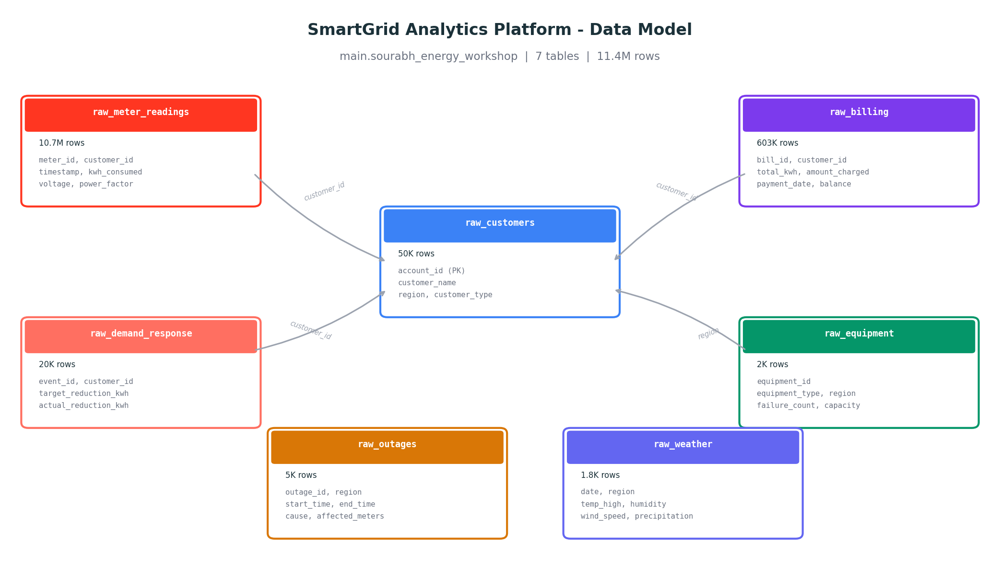
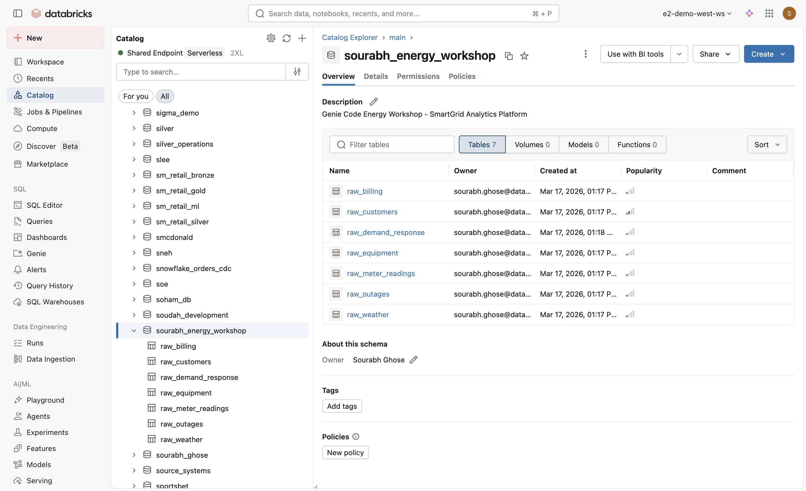
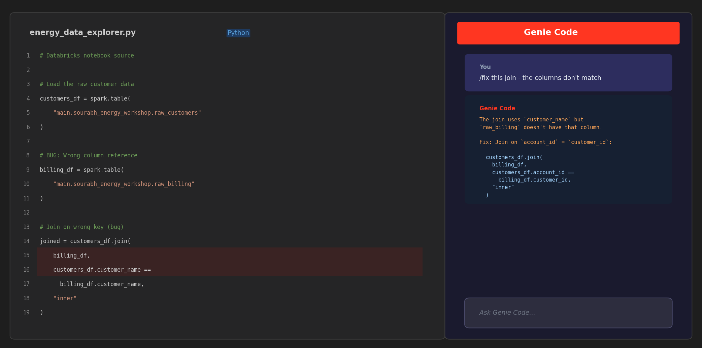
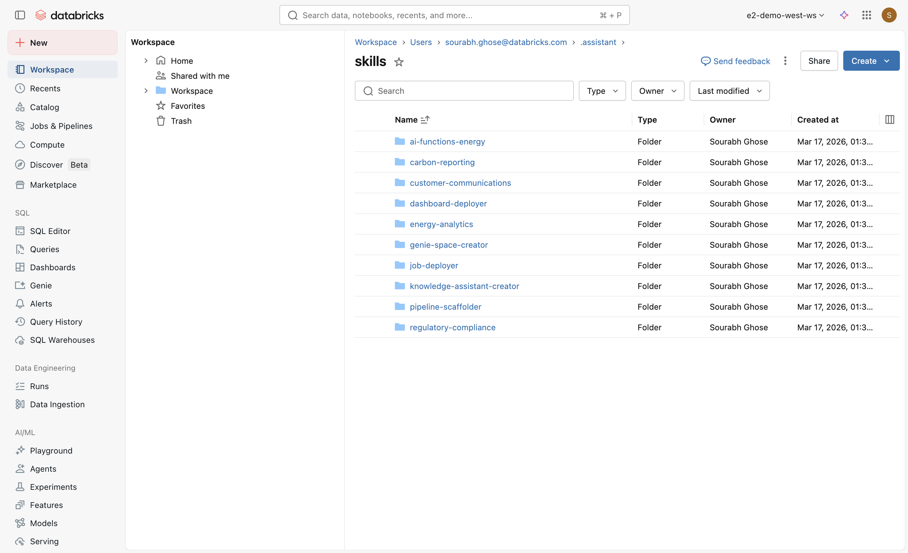

# Genie Code for Energy: Vibe Coding Workshop

A comprehensive, modular workshop for learning **Databricks Genie Code** by building an end-to-end energy analytics platform. Participants play the role of a data team at a retail energy provider, using Genie Code's AI assistant to build pipelines, models, dashboards, and monitoring -- all through natural language.



## Workshop Theme

**SmartGrid Analytics Platform** -- Build analytics covering customer segmentation, demand forecasting, grid reliability, predictive maintenance, and sustainability reporting for a retail energy provider serving 50,000 customers across 6 Australian states (NSW, VIC, QLD, SA, WA, TAS). Includes geospatial coordinates for map visualizations.

## Getting Started

### Prerequisites

- Databricks workspace with Unity Catalog enabled
- Genie Code enabled (including Agent mode preview)
- Partner-powered AI features enabled

### Quick Start

1. **Run data generation**: Import and run `setup/generate_energy_data.py` as a notebook
2. **Verify data**: Confirm 7 tables exist in `main.sourabh_energy_workshop`
3. **Follow the guides**: Start with `guides/00-setup.md`, then proceed to any module

## Repository Structure

```
genie_for_energy/
├── README.md                          # This file
├── images/                            # Documentation images (data model, screenshots)
├── guides/                            # Step-by-step participant guides
│   ├── 00-setup.md                    # Environment setup (15 min)
│   ├── 01-fundamentals.md             # Genie Code feature tour (60 min)
│   ├── 02-data-engineering.md         # Lakeflow pipelines (60 min)
│   ├── 03-data-science.md             # ML with Agent mode (60 min)
│   ├── 04-dashboards.md               # AI/BI dashboards lifecycle (90 min)
│   ├── 04b-debugging.md               # Cross-surface debugging (60 min)
│   ├── 05-extending.md                # Skills, MCP, instructions (75 min)
│   ├── 06-genai-observability.md       # MLflow + Genie Code (60 min)
│   └── 07-measuring-impact.md         # System tables & ROI (30 min)
├── setup/
│   └── generate_energy_data.py        # Faker + PySpark data generation notebook
├── modules/
│   ├── 01-fundamentals/
│   │   └── energy_data_explorer.py    # Notebook with 3 planted bugs
│   ├── 02-data-engineering/
│   │   └── prompt_guide.py            # Pipeline building prompts
│   ├── 03-data-science/
│   │   └── prompt_guide.py            # ML prompts (segmentation, forecasting, churn)
│   ├── 04-dashboards/
│   │   └── prompt_guide.py            # 15 dashboard building prompts (incl. maps)
│   ├── 04b-debugging-observability/
│   │   ├── prompt_guide.py            # Debugging scenarios guide
│   │   └── broken_notebook.py         # Notebook with 4 complex bugs
│   ├── 05-extending/
│   │   └── skills/                    # 10 pre-built Agent Skills
│   │       ├── genie-space-creator/   # Tier 3: Creates Genie Spaces via API
│   │       ├── dashboard-deployer/    # Tier 3: Deploys AI/BI dashboards
│   │       ├── job-deployer/          # Tier 3: Creates scheduled jobs
│   │       ├── pipeline-scaffolder/   # Tier 3: Scaffolds medallion pipelines
│   │       ├── knowledge-assistant-creator/ # Tier 3: Creates RAG assistants
│   │       ├── ai-functions-energy/   # Tier 2: AI SQL functions
│   │       ├── energy-analytics/      # Tier 1: KPIs & data dictionary
│   │       ├── regulatory-compliance/ # Tier 1: AEMO/AER standards
│   │       ├── carbon-reporting/      # Tier 1: Emissions & ESG
│   │       └── customer-communications/ # Tier 1: Customer templates
│   ├── 06-genai-observability/
│   │   └── prompt_guide.py            # MLflow trace analysis prompts
│   └── 07-measuring-impact/
│       └── system_table_queries.py    # System table queries notebook
└── facilitator/                       # Facilitator resources (TBD)
```

## Modules

Each module is independent and can be combined based on audience and time:

| Module | Duration | Genie Code Surface | Description |
|--------|----------|-------------------|-------------|
| **0: Setup** | 15 min | -- | Generate data, enable features, verify access |
| **1: Fundamentals** | 60 min | Notebooks (Chat) | All slash commands, inline assistant, autocomplete, error handling |
| **2: Data Engineering** | 60 min | Lakeflow (Agent) | Build a medallion pipeline for energy data |
| **3: Data Science** | 60 min | Notebooks (Agent) | Customer segmentation, demand forecasting, churn prediction |
| **4: Dashboards** | 90 min | Dashboards (Agent) | Full lifecycle: creation to publishing, 15 prompts (incl. map/geo) |
| **4B: Debugging** | 60 min | All Surfaces | Cross-surface debugging and observability |
| **5: Extending** | 75 min | All | Custom instructions, 10 Agent Skills, MCP integration |
| **6: GenAI Observability** | 60 min | MLflow (Agent) | Trace analysis, evaluation, instrumentation |
| **7: Impact** | 30 min | System Tables | Adoption metrics and impact dashboard |

## Suggested Workshop Combinations

| Duration | Name | Modules |
|----------|------|---------|
| 90 min | Lightning Demo | 0 + 1 (partial) + 4 (partial) |
| 2 hr | Feature Showcase | 0 + 1 + 4 (partial) |
| 3 hr | Half-Day Core | 0 + 1 + 2 + 3 |
| 3 hr | Energy Ops Focus | 0 + 1 (partial) + 2 + 4 (partial) + 5C |
| 4 hr | Half-Day Extended | 0 + 1 + 2 + 3 + 4 (partial) |
| Full day | Complete Workshop | All modules 0-7 |

## Synthetic Dataset

All data is generated via Faker + PySpark. No external downloads needed.



| Table | Rows | Key Features |
|-------|------|-------------|
| `raw_customers` | 50,000 | 6 Australian states, 3 customer types, 4 rate plans, solar/EV flags, lat/lon coordinates |
| `raw_meter_readings` | ~10.7M | Hourly intervals, 230V grid, realistic diurnal curves, seasonal patterns (Southern Hemisphere) |
| `raw_billing` | ~603K | Monthly bills in AUD, 8% delinquency rate, 0.5% duplicate records |
| `raw_outages` | 5,000 | 6 cause types, exponential duration, lat/lon coordinates, 1% future-dated (DQ issue) |
| `raw_weather` | 2,190 | 365 days x 6 states, Celsius temps, humidity, wind (km/h), precipitation (mm) |
| `raw_equipment` | 2,000 | 5 asset types, age-correlated failure rates, lat/lon coordinates |
| `raw_demand_response` | 20,000 | 70% participation rate, 3 event types, AUD incentives |

**Seeded data quality issues** for realistic cleaning exercises:
- ~2% null meter readings
- ~0.1% negative kWh values
- ~0.5% duplicate billing records
- ~1% future-dated outage records

## Genie Code in Action


*The Genie Code pane alongside a notebook — showing a `/fix` conversation that identifies and corrects a wrong join column.*

## Agent Skills (10 Energy Skills)



| Tier | Skill | Trigger Prompt |
|------|-------|---------------|
| 3 | `genie-space-creator` | "Create a Genie Space for our billing data" |
| 3 | `dashboard-deployer` | "Deploy our operations dashboard" |
| 3 | `job-deployer` | "Deploy our pipeline as a nightly job" |
| 3 | `pipeline-scaffolder` | "Create a medallion pipeline for meter readings" |
| 3 | `knowledge-assistant-creator` | "Create a Knowledge Assistant for rate docs" |
| 2 | `ai-functions-energy` | "Forecast next week's demand" |
| 1 | `energy-analytics` | "Calculate our reliability KPIs" |
| 1 | `regulatory-compliance` | "Check if we meet AEMO/AER standards" |
| 1 | `carbon-reporting` | "Calculate our Scope 2 emissions" |
| 1 | `customer-communications` | "Generate rate change notices" |

## Next Step

**Ready to get started?** Head to the **[Environment Setup Guide](guides/00-setup.md)** to configure your workspace, generate the energy dataset, and run your first Genie Code query.

## Tested & Verified

- **Data generation**: Ran successfully via serverless compute (144s)
- **Module 1 bugs**: Verified -- `kwh_used` triggers `UNRESOLVED_COLUMN` error as expected
- **Module 7 queries**: Verified -- `system.access.assistant_events` returns real data
- **All analytics queries**: Verified -- SAIDI, revenue, demand response metrics work correctly
