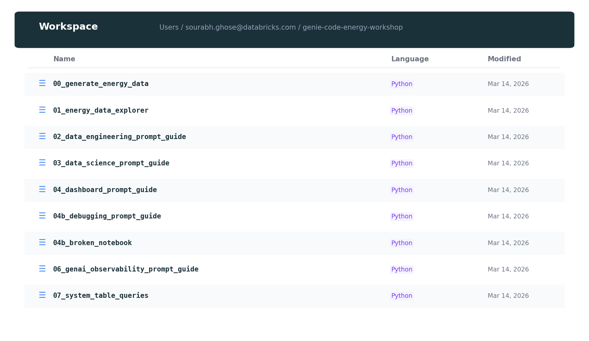
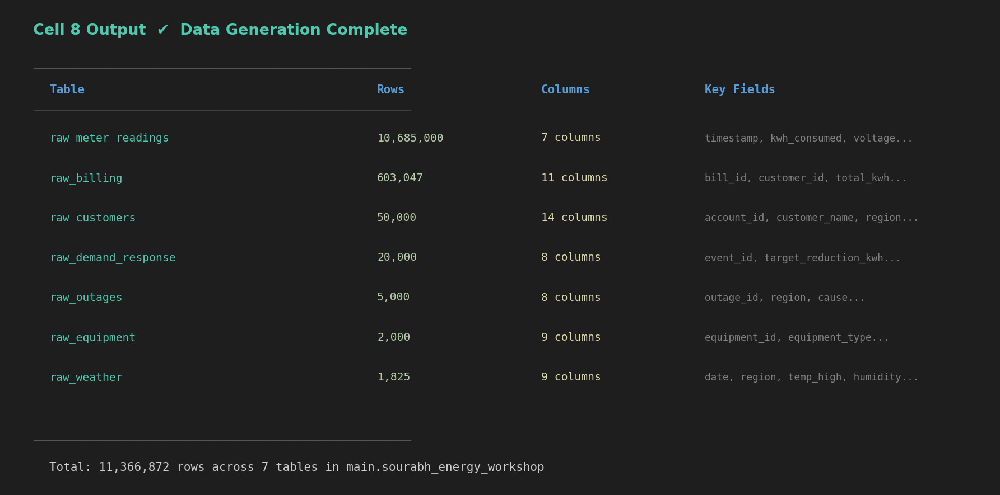

# Module 0: Environment Setup

**Genie Code Energy Workshop — SmartGrid Analytics Platform**

Welcome! This guide walks you through setting up your environment for the Genie Code workshop. You'll configure your workspace, generate the energy dataset, and run your first Genie Code query. Plan for **~15 minutes**.


*The SmartGrid Analytics Platform data model — 7 interconnected tables with 11.4M rows of real energy data.*

---

## Prerequisites

Before you begin, ensure you have:

| Requirement | Details |
|-------------|---------|
| **Databricks workspace access** | You need access to a Databricks workspace with Unity Catalog enabled |
| **Unity Catalog enabled** | The workspace must have Unity Catalog enabled (standard for most Databricks workspaces) |
| **Genie Code enabled** | Genie Code must be turned on in your workspace (we'll do this in the next section) |
| **Compute** | A cluster or SQL warehouse for running notebooks and queries |

> **Step 1:** Log in to your Databricks workspace (URL provided by your facilitator).  
> **What you'll see:** The Databricks home page or your workspace landing page.  
> **Key concept:** You need workspace access with permissions to run notebooks and query Unity Catalog tables.

---

## Enable Genie Code

Genie Code is an AI assistant built into Databricks. It may be available as a preview feature depending on your workspace configuration.

> **Step 2:** Enable Genie Code (if not already enabled).  
> **Action:** Click your **username** in the top-right corner of the Databricks workspace. From the menu, select **Previews**. Look for **"Genie Code Agent mode"** or **"Genie Code"** and toggle it **On**.  
> **What you'll see:** A list of preview features with toggles. Enable the Genie Code–related preview(s).  
> **Key concept:** Previews give early access to new features. Genie Code Agent mode enables autonomous multi-step tasks.


> **Alternative (Account-level):** If you're an account admin, you can enable previews for all workspaces: log in to the [account console](https://accounts.cloud.databricks.com/), click **Previews** in the sidebar, and use the toggles.

---

## Enable Partner-Powered AI Features

Genie Code uses AI models to generate and fix code. **Partner-powered AI** allows Databricks to use models from partners (e.g., Azure OpenAI, Anthropic) for richer capabilities. **Agent mode** requires this setting to be enabled.

### Account Level

> **Step 3a:** Enable Partner-powered AI at the account level (if you're an account admin).  
> **Action:** Log in to the [account console](https://accounts.cloud.databricks.com/). Go to **Settings** → **Feature enablement** tab. For **Enable partner-powered AI features**, select **On**.  
> **What you'll see:** A toggle or dropdown for the feature.  
> **Key concept:** Account-level settings apply to all workspaces unless overridden.

### Workspace Level

> **Step 3b:** Enable Partner-powered AI at the workspace level.  
> **Action:** In the Databricks workspace, click your **username** → **Settings**. Under **Workspace admin**, open the **Advanced** tab. Find **Partner-powered AI features** and ensure the toggle is **On**.  
> **What you'll see:** Workspace settings with AI-related options.  
> **Key concept:** Workspace admins can override account settings. If Partner-powered AI is off, Genie Code Agent mode will not be available.


---

## Navigate to the Workshop Notebooks

> **Step 4:** Open the workshop folder.  
> **Action:** In the left sidebar, click **Workspace** (or **Browse**). Navigate to the workshop folder, e.g. `/Users/<your-email>@databricks.com/genie-code-energy-workshop/` or the path provided by your facilitator.  
> **What you'll see:** A folder containing notebooks including `00_generate_energy_data` and `01_energy_data_explorer`.  
> **Key concept:** Workshop materials are stored in your workspace. You may need to clone or import them if they're shared.


*Workshop notebooks in the Databricks workspace — 9 notebooks covering data generation through system table analysis.*


---

## Run the Data Generation Notebook

The workshop uses a synthetic energy dataset. You must generate it once before starting the modules.

> **Step 5:** Open and run the data generation notebook.  
> **Action:** Open `00_generate_energy_data` (or `setup/00_generate_energy_data`). Attach a **cluster** (or use serverless compute). Click **Run all** (or run each cell in order). Wait for completion.  
> **What you'll see:** Progress output as each table is created. The notebook installs `faker`, creates the schema `main.sourabh_energy_workshop`, and populates 7 tables.  
> **Key concept:** The notebook generates realistic synthetic data with intentional data quality issues for later exercises.


*Successful data generation output — 11.4M rows across 7 tables in `main.sourabh_energy_workshop`.*

> **Note:** The first cell installs `faker` and may restart the Python kernel. Re-run from the top if needed.

---

## Verify the Data

Confirm that all tables exist and have the expected row counts.

> **Step 6:** Run these SQL queries to verify the data.  
> **Action:** Open a **SQL editor** or a new notebook. Run each query below (or run them in a single cell with multiple statements).

```sql
-- Check schema and table existence
SHOW TABLES IN main.sourabh_energy_workshop;

-- Verify row counts
SELECT 'raw_customers' AS table_name, COUNT(*) AS row_count FROM main.sourabh_energy_workshop.raw_customers
UNION ALL
SELECT 'raw_meter_readings', COUNT(*) FROM main.sourabh_energy_workshop.raw_meter_readings
UNION ALL
SELECT 'raw_billing', COUNT(*) FROM main.sourabh_energy_workshop.raw_billing
UNION ALL
SELECT 'raw_outages', COUNT(*) FROM main.sourabh_energy_workshop.raw_outages
UNION ALL
SELECT 'raw_weather', COUNT(*) FROM main.sourabh_energy_workshop.raw_weather
UNION ALL
SELECT 'raw_equipment', COUNT(*) FROM main.sourabh_energy_workshop.raw_equipment
UNION ALL
SELECT 'raw_demand_response', COUNT(*) FROM main.sourabh_energy_workshop.raw_demand_response;
```

> **What you'll see:** Seven tables listed, with row counts approximately: 50K (customers), ~10.7M (meter readings), ~600K (billing), ~5K (outages), ~1.8K (weather), ~2K (equipment), ~20K (demand response).  
> **Key concept:** Unity Catalog tables live in `catalog.schema.table`. Verifying counts ensures the workshop data is ready.


*All 7 energy tables in Unity Catalog — from 10.7M meter readings down to 1,825 weather records.*

---

## Open the Genie Code Pane

> **Step 7:** Open Genie Code and explore its controls.  
> **Action:** Click the **Genie Code icon** in the **upper-right corner** of the page (the AI assistant icon). The Genie Code pane opens—usually docked at the bottom or on the right.  
> **What you'll see:** A chat-style interface with a text box at the bottom. In the header you'll see: **New thread** (start fresh), **Settings** (custom instructions), **History** (past conversations), and **Close**.  
> **Key concept:** Genie Code is a context-aware assistant. It can see your notebook, tables, and code to provide relevant help.


*The Genie Code pane (right) alongside a notebook — showing a `/fix` conversation that identifies a wrong join column.*


> **Step 7b:** Click **History** to view past chat threads. Click **Settings** to add custom instructions (optional for now).

---

## First Test Query

> **Step 8:** Run your first Genie Code query.  
> **Action:** In the Genie Code text box, type:

```
Describe the tables in my energy schema. How many customers do we have?
```

> Press **Enter**.  
> **What you'll see:** Genie Code will describe the tables in `main.sourabh_energy_workshop` and answer the customer count (50,000). It may run a SQL query to get the count.  
> **Key concept:** Genie Code uses Unity Catalog metadata and can execute queries to answer natural language questions.


---

## Chat Mode vs. Agent Mode

Genie Code has two modes. Understanding the difference will help you choose the right one for each task.

> **Step 9:** Locate the mode selector at the bottom of the Genie Code pane.  
> **Action:** Look for a toggle or dropdown that switches between **Chat** and **Agent** mode.  
> **What you'll see:** Two options—Chat and Agent.

| Mode | Best for | Example |
|------|----------|---------|
| **Chat** | Quick questions, code generation, explanations, single-step fixes | "What does this function do?" "Write a query to find top 10 customers by consumption." |
| **Agent** | Multi-step tasks, exploratory analysis, pipeline creation, fixing errors across cells | "Analyze @raw_meter_readings and create a dashboard." "Fix all the bugs in this notebook." |

> **Key concept:** **Chat** answers questions and generates code in the conversation. **Agent** plans, retrieves assets, runs code, and can make changes across multiple cells or files autonomously.

---

## Troubleshooting

| Issue | What to try |
|-------|-------------|
| **Genie Code icon not visible** | Ensure Genie Code preview is enabled. Refresh the page. Check that you're not in a restricted workspace. |
| **Agent mode grayed out** | Enable **Partner-powered AI features** at account or workspace level. Agent mode requires partner models. |
| **"No compute" or execution errors** | Attach a cluster to your notebook or ensure a SQL warehouse is running. Genie Code uses your notebook's compute by default. |
| **Tables not found** | Confirm you ran `00_generate_energy_data` and that the schema is `main.sourabh_energy_workshop`. Re-run the verification queries. |
| **Permission denied on tables** | Ensure your user has `SELECT` on the schema and tables. Ask your admin to grant access. |
| **Data generation fails** | Check that `faker` installs correctly. Restart the kernel after `%pip install` and run all cells again. |

---

## You're Ready!

You've completed Module 0. You have:

- Genie Code and Partner-powered AI enabled  
- The energy dataset generated and verified  
- The Genie Code pane open and tested  
- An understanding of Chat vs. Agent mode  

**Next:** Proceed to [Module 1: Genie Code Fundamentals](01-fundamentals.md) for a complete tour of slash commands, inline assistant, error handling, and more.
