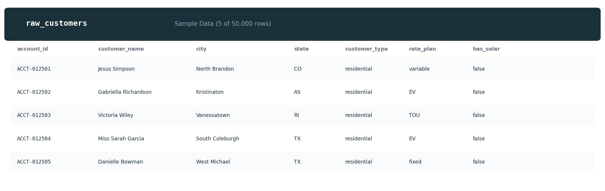

# Module 3: Data Science & ML

**Duration:** 60 minutes  
**Catalog/Schema:** `main.sourabh_energy_workshop`

---

## Storyline

Marketing wants customer segments for targeted campaigns. Operations wants demand forecasts. Leadership wants churn risk scores. Genie Code helps you build all three—with natural language prompts and autonomous feature engineering.

---

## Data Context


*Sample data from `raw_customers` — 50,000 customers with account details, rate plans, and feature flags.*

| Table | Key Columns |
|-------|-------------|
| `raw_customers` | account_id, customer_name, region, customer_type, rate_plan, signup_date, contract_end_date, has_solar, has_ev |
| `raw_billing` | bill_id, customer_id, billing_period, total_kwh, peak_kwh, off_peak_kwh, amount_charged, amount_paid, payment_date, balance, is_delinquent |
| `raw_meter_readings` | meter_id, customer_id, timestamp, kwh_consumed, is_peak_hour |
| `raw_weather` | date, region, temp_high, temp_low, humidity, wind_speed, precipitation, is_extreme_heat, is_extreme_cold |
| `raw_outages` | outage records by region |

**Join key:** `raw_customers.account_id` = `raw_billing.customer_id`

---

## Part A: Customer Segmentation (25 min)

### Step 1: Create a New Notebook

1. Open Databricks workspace → **New** → **Notebook**.
2. Name it: **Energy Customer Segmentation**.
3. Turn on **Genie Code Agent mode** in the side panel.

### Step 2: Initial Segmentation Prompt

Type this exact prompt:

```
Analyze our energy customers and segment them into meaningful groups based on their consumption patterns, billing behavior, and demographics. Use main.sourabh_energy_workshop.raw_billing joined with main.sourabh_energy_workshop.raw_customers on account_id = customer_id. I want to understand which customers are high-value, which are at risk, and which might benefit from different rate plans.
```

### Step 3: What to Watch

Genie Code will typically:

- **Discover data:** Inspect schema, sample rows, profile distributions.
- **Engineer features:** e.g., avg monthly kwh, peak-to-offpeak ratio, payment timeliness, tenure.
- **Train clustering:** K-Means or similar.
- **Visualize:** Cluster scatter plots, cluster size distributions.

### Step 4: Follow-up Prompts

**Prompt 1 – Name segments:**

```
Can you name each segment and describe their characteristics? Which segment should we target for our new EV rate plan?
```

**Prompt 2 – Add propensity score:**

```
Add a solar adoption propensity score based on consumption patterns and region
```

### Key Concept

Genie Code reads your data context, chooses features, and iterates. You don’t need to specify every column—it infers from the schema and your goals.

---

## Part B: Demand Forecasting (20 min)

### Step 1: Demand Forecasting Prompt

Type:

```
Build a demand forecasting model that predicts daily energy consumption for each region over the next 7 days. Use meter readings from main.sourabh_energy_workshop.raw_meter_readings aggregated to daily totals by region, joined with weather data from main.sourabh_energy_workshop.raw_weather. Include temperature as a key feature since consumption is weather-dependent.
```

### Step 2: What to Watch

- **Time series feature engineering:** Lag features, rolling averages, day-of-week.
- **Model training:** Prophet, ARIMA, or simple regression.
- **Forecast vs actuals plot:** Visual comparison of predicted vs historical consumption.

### Step 3: Scenario Modeling Prompt

```
What would demand look like if we had an extreme heat wave next week? Model a scenario where temperatures are 10 degrees above average.
```

### Key Concept

Genie Code handles feature engineering and scenario modeling. You describe the scenario; it adjusts inputs and produces the forecast.

---

## Part C: Churn Prediction (15 min)

### Step 1: Churn Definition Prompt

Type:

```
Build a churn prediction model. Define churn as a customer whose contract_end_date is within the next 90 days and has at least 2 delinquent bills in the past 6 months. Use billing history, consumption trends, customer demographics, and outage exposure as features. Join raw_customers (account_id) with raw_billing (customer_id) and raw_outages.
```

### Step 2: What to Watch

- **Feature engineering:** Payment delinquency, consumption trends, tenure, region, outage exposure.
- **Classifier training:** Logistic regression, Random Forest, or XGBoost.
- **Feature importance:** Which features drive churn.
- **ROC curve:** Model performance visualization.

### Step 3: Cross-reference with Segmentation

```
Which customer segment from Part A has the highest churn risk and what intervention would you recommend?
```

### Key Concept

Genie Code can connect multiple analyses—segmentation + churn—and produce recommendations.

---

## Hands-on Challenge

### Task

Use Genie Code to investigate **demand response program effectiveness** across customer segments.

### Prompt Hints

- **Data:** `main.sourabh_energy_workshop.raw_demand_response` (20K rows) joined with `raw_customers` and `raw_billing`.
- **Questions to explore:**
  - Which segments enroll most in demand response?
  - Do enrolled customers show different consumption patterns during peak vs off-peak?
  - Is there a correlation between enrollment and lower billing amounts or delinquency?

### Suggested Prompt

```
Analyze demand response program effectiveness. Join raw_demand_response with raw_customers and raw_billing. Compare enrolled vs non-enrolled customers by consumption patterns, peak vs off-peak usage, and billing outcomes. Which customer segments benefit most from enrollment?
```

### Tips

- If Genie Code's output differs from expected, that's normal—it's non-deterministic. The important thing is the general approach: joins, feature engineering, and analysis.
- You may need to clarify the schema of `raw_demand_response` if it’s not obvious from the prompt.

---

## Summary

| Part | Time | Key Takeaway |
|------|------|--------------|
| A | 25 min | Customer segmentation: Genie Code discovers data, engineers features, clusters, and visualizes |
| B | 20 min | Demand forecasting: time series + weather + scenario modeling |
| C | 15 min | Churn prediction: define churn, join tables, train classifier, interpret |
| Challenge | — | Demand response effectiveness across segments |

---

## Quick Reference: Prompts

| Use Case | Prompt |
|----------|--------|
| Segmentation | "Analyze our energy customers and segment them into meaningful groups based on their consumption patterns, billing behavior, and demographics. Use main.sourabh_energy_workshop.raw_billing joined with main.sourabh_energy_workshop.raw_customers on account_id = customer_id..." |
| Demand forecast | "Build a demand forecasting model that predicts daily energy consumption for each region over the next 7 days. Use meter readings from main.sourabh_energy_workshop.raw_meter_readings aggregated to daily totals by region, joined with weather data from main.sourabh_energy_workshop.raw_weather..." |
| Churn | "Build a churn prediction model. Define churn as a customer whose contract_end_date is within the next 90 days and has at least 2 delinquent bills in the past 6 months..." |
| Demand response | "Analyze demand response program effectiveness. Join raw_demand_response with raw_customers and raw_billing..." |
