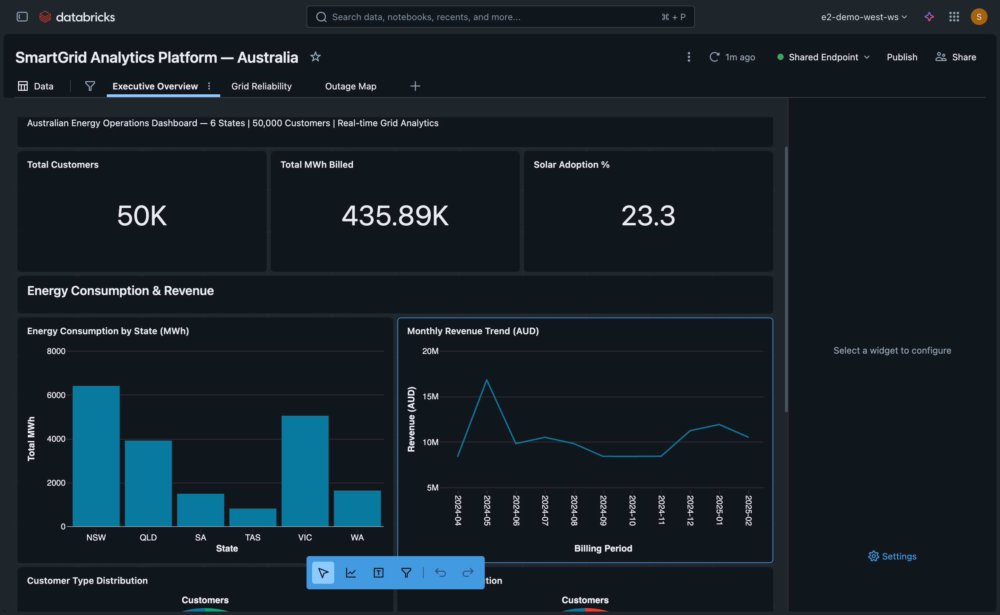
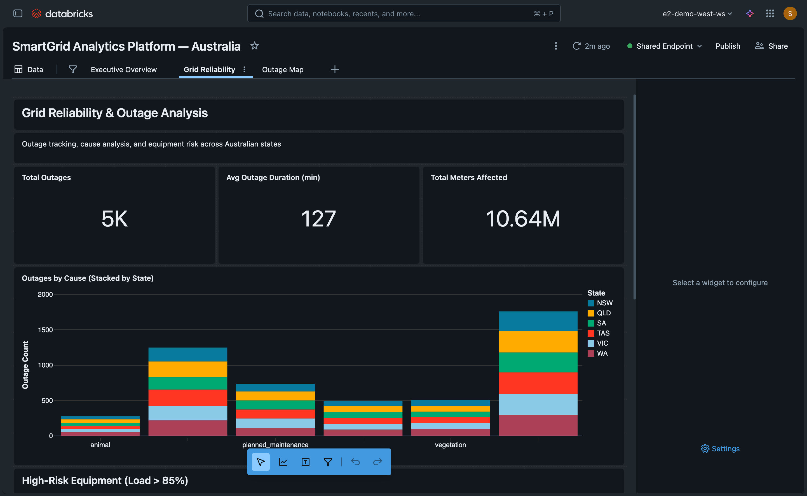
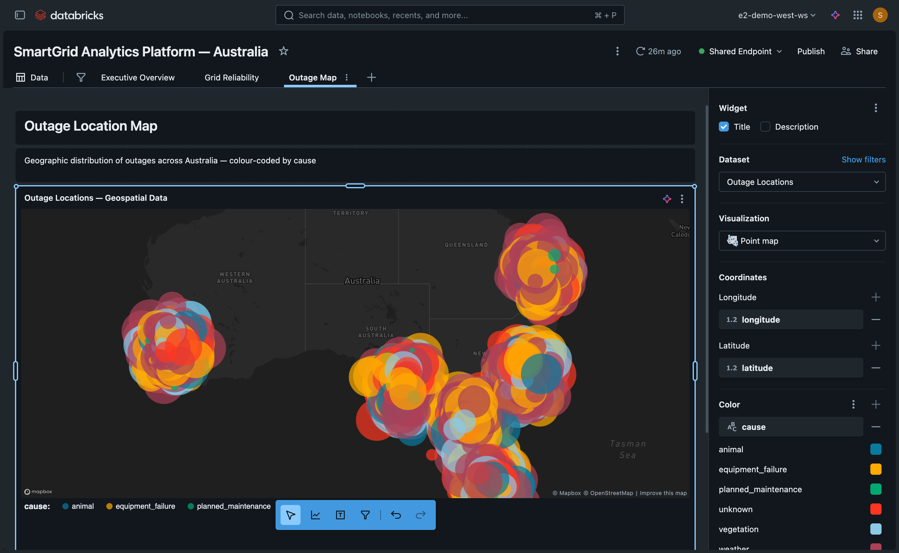

# Module 4: AI/BI Dashboards Full Lifecycle (90 min)

**Storyline:** *"The CEO wants a single dashboard to monitor grid operations, customer health, and financial performance."*

---

## Prerequisites

- Access to Databricks workspace with AI/BI (Lakeview) enabled
- Catalog/Schema: `main.sourabh_energy_workshop`
- Tables: `raw_customers` (50K), `raw_billing` (600K), `raw_outages` (5K), `raw_equipment` (2K), `raw_meter_readings` (10.7M), `raw_weather` (2.2K), `raw_demand_response` (20K)
- Genie Code pane available (Agent mode)


*Data model overview — your dashboard will draw from all 7 interconnected tables.*

---

> **Reference Dashboard:** A pre-built "SmartGrid Analytics Platform — Australia" dashboard is available in your workspace as a reference. It includes 3 pages (Executive Overview, Grid Reliability, Outage Map) with KPIs, bar/line/pie charts, a stacked bar, an equipment risk table, and an interactive point map. The screenshots in this guide are taken from this reference. Your goal in this module is to **build your own dashboard from scratch** using Genie Code prompts.

---

## 4A: Dashboard Creation (20 min)

### Step 1: Create a New Dashboard

1. In the Databricks workspace, click **New** → **Dashboard**
2. Name the dashboard: **SmartGrid Operations Center**
3. Save the dashboard to your workspace folder

### Step 2: Open Genie Code

1. Locate the **Genie Code** pane (typically on the right or bottom of the dashboard editor)
2. Switch to **Agent mode** (not Chat mode) for full dashboard generation capabilities

### Step 3: Build the Initial Dashboard

Copy and paste this prompt into Genie Code:

```
Build an energy operations dashboard using these tables from main.sourabh_energy_workshop: raw_customers, raw_billing, raw_outages, raw_equipment. Include: (1) Revenue and consumption trends over time, (2) State-level grid load comparison, (3) Customer type distribution as a pie chart, (4) Outage frequency and duration by cause as a stacked bar, (5) Top 10 at-risk equipment by load percentage. Add filters for date range, state, and customer type.
```

**What to watch:**

- Genie Code creates **datasets** (SQL queries that power the dashboard)
- Genie Code arranges **widgets** (visualizations) on the canvas
- Genie Code adds **filters** (parameters that slice the data)

**Key concepts:**

| Term | Meaning |
|------|---------|
| **Datasets** | SQL queries that define the data for each visualization |
| **Widgets** | Individual charts, tables, KPIs, and filters |
| **Parameters** | Filters that let users slice data (date range, state, customer type) |

**Expected result:** A dashboard with 5+ visualizations and 3 filters. Revenue/consumption trends as a line chart, state comparison as a bar chart, customer type as a pie chart, outage cause as a stacked bar, and an equipment table.


*Example: Executive Overview page with KPIs, consumption bar chart, and revenue trend line chart.*

---

## 4B: Custom Calculations (15 min)

### Prompt 2: Consumption Tiers and Revenue per kWh

```
Add a custom calculation to categorize customers into consumption tiers: 'Low' (under 500 total_kwh), 'Medium' (500-1500), 'High' (over 1500). Also add average revenue per kWh as a calculated measure.
```

**Expected result:** A new dataset or modified dataset with `consumption_tier` and `avg_revenue_per_kwh` columns. You may see a new widget or updated table/chart using these fields.

### Prompt 3: Rolling Averages and Percent of Total

```
Add a rolling 7-day average consumption trend using a window function, and show each state's consumption as a percentage of total.
```

**Expected result:** A line chart with a 7-day rolling average, and a chart or table showing state consumption as % of total.


*Example: Grid Reliability page with outage KPIs, stacked bar chart by cause, and equipment risk table.*

**Key concepts – 4 types of custom calculations:**

| Type | Use Case | Example |
|------|----------|---------|
| **Calculated measures** | Aggregations with formulas | `SUM(amount_charged) / SUM(total_kwh)` |
| **Calculated dimensions** | CASE/WHEN logic | `CASE WHEN total_kwh < 500 THEN 'Low' ...` |
| **LOD expressions** | Fixed-level aggregations | Total across all states |
| **Window functions** | Rolling, ranking, running totals | `AVG(kwh) OVER (ORDER BY date ROWS 6 PRECEDING)` |

---

## 4C: Visualizations & Formatting (10 min)

### Prompt 4: Gauge, KPI, and Heatmap

```
Add a gauge chart showing equipment utilization for each state, a single-value KPI showing total MWh consumed this month, and a heatmap of outages by cause and state.
```

**Expected result:** A gauge (or similar) for equipment load by state, a large KPI number for MWh, and a heatmap with cause on one axis and state on the other.

### Prompt 5: Conditional Formatting

```
Apply conditional formatting to the equipment table: red for current_load_pct > 85, yellow for 60-85, green for < 60.
```

**Expected result:** The equipment table shows color-coded cells based on `current_load_pct`.

**Tip:** If Genie Code doesn’t support conditional formatting directly, you may need to add a calculated column (e.g., `load_status`) and use it for color encoding.

---

## 4D: Interactivity (10 min)

### Prompt 6: Cross-Filtering and Drill-Through

```
Enable cross-filtering so clicking a state in the bar chart filters all other widgets. Add drill-through from the state chart to a detail page showing that state's equipment and outage breakdown.
```

**Expected result:** Clicking a state in the bar chart filters all widgets. A drill-through action opens a detail page with equipment and outage data for that state.

### Prompt 7: Query-Based Parameter

```
Add a query-based parameter that lets users select from rate plans (populated dynamically from raw_customers), and use it to filter the revenue widgets.
```

**Expected result:** A dropdown filter populated from `rate_plan` in `raw_customers`, filtering revenue-related widgets.

**Key concept:** Query-based parameters pull values from the data instead of hardcoding options.

---

## 4E: What-If Analysis (10 min)

### Prompt 8: What-If Rate Analysis

```
Add a What-If Rate Analysis page. Let users input a percentage rate change and see projected impact on monthly revenue, computed from current billing data.
```

**Expected result:** A page with an input for rate change % and a visualization of projected revenue impact.

### Prompt 9: Sustainability Page

```
Add a Sustainability page showing total consumption, estimated carbon emissions (0.4 kg CO2 per kWh), solar customer penetration rate, and demand response effectiveness.
```

**Expected result:** A new page with KPIs for consumption, CO2 emissions, solar penetration, and demand response metrics.

### Prompt 10: Explanatory Text

```
Add explanatory text and section headers so non-technical executives can understand each page.
```

**Expected result:** Text widgets with titles and short descriptions for each section.

---

## 4F: Map Visualizations (15 min)

The dataset includes latitude and longitude coordinates on `raw_customers`, `raw_outages`, and `raw_equipment`, enabling geographic visualizations across Australia.

### Prompt 13: Outage Map

```
Add a map visualization showing outage locations across Australia. Use raw_outages from main.sourabh_energy_workshop — it has latitude and longitude columns. Color-code markers by cause (weather, equipment_failure, vegetation, etc.). Size markers by affected_meters_count. Title: "Outage Map — Australia".
```

**Expected result:** A map centred on Australia with markers for each outage, coloured by cause and sized by impact.


*Example: Point map with 5,000 outage locations colour-coded by cause and sized by affected meters count.*

### Prompt 14: Customer Density Map

```
Add a customer density map showing where our 50K customers are located across Australia. Use raw_customers from main.sourabh_energy_workshop — it has latitude and longitude columns. Use a heatmap or cluster layer to show density. Add a filter for customer_type (residential, commercial, industrial).
```

**Expected result:** A heatmap or clustered marker map showing customer concentrations across Australian cities.

### Prompt 15: Equipment & Outage Overlay Map

```
Create a "Grid Infrastructure" map page. Plot equipment locations from raw_equipment (has latitude, longitude) colored by equipment_type, and overlay outage locations from raw_outages (also has latitude, longitude) colored by restoration_priority. Use main.sourabh_energy_workshop. Add filters for state and equipment_type.
```

**Expected result:** A dual-layer map enabling spatial correlation between infrastructure and outage hotspots.

**Key concepts:**

| Concept | Details |
|---------|---------|
| **Coordinate columns** | `latitude` and `longitude` (DOUBLE) on customers, outages, and equipment |
| **Map types** | Scatter-on-map, heatmap, clustered markers |
| **Encoding** | Colour by category (cause, type), size by numeric (affected_meters_count) |
| **Filtering** | State and customer_type filters work with map widgets |

---

## 4G: Publishing & Sharing (10 min)

### Prompt 11: Understand Publishing Options

```
Help me understand the publishing options for this dashboard.
```

**Expected result:** Genie Code explains draft vs published, permission models, and sharing options.

### Step: Publish the Dashboard

1. Click **Publish** (or equivalent) in the dashboard editor
2. Note the difference between **Draft** (editable) and **Published** (read-only snapshot)
3. Review permission models (workspace, account, public)

### Step: Share with Workspace Users

1. Use the **Share** or **Permissions** dialog
2. Add workspace users or groups
3. Explain account-level sharing

### Step: Scheduled Refresh

1. Open dashboard settings
2. Set a **scheduled refresh** (e.g., weekly)
3. Ensure the SQL warehouse is available for the schedule

---

## 4H: Debugging (10 min)

### Step: Break a Dataset

1. Open one of the dashboard datasets
2. Change a table reference (e.g., `raw_billing` → `raw_billing_typo`)
3. Save and observe the error in the revenue trend widget

### Prompt 12: Fix the Error

```
The revenue trend widget is showing an error. Fix it.
```

**Expected result:** Genie Code identifies the wrong table name and corrects it.

### Step: Optimize Slow Queries

1. Identify a slow-running dataset (or simulate with a large table)
2. Ask Genie Code: **"Optimize the slow queries in this dashboard"** or use the **Optimize** action
3. Review suggestions (e.g., filters, aggregations, partition pruning)

---

## 4I: Dashboard as Code (5 min)

### Brief Overview

- **Export as JSON:** Dashboards can be exported as JSON for version control
- **Databricks Asset Bundles (DABs):** Dashboards can be defined in YAML and deployed via DABs
- **REST API:** Programmatic create/update/delete of dashboards

**No hands-on steps** – this is informational for participants who want to automate deployment.

---

## Hands-On Challenge

**Build an "Equipment Reliability" page** with:

1. **Box plot** – Distribution of `current_load_pct` or `failure_count` by state
2. **Choropleth** – Geographic view of equipment load or outage density by state
3. **Detail table** – Equipment list with key columns (equipment_id, type, state, load %, failure count)
4. **Cross-filtering** – Clicking a state filters the box plot and table

**Time:** ~15 minutes  
**Hint:** Use `raw_equipment` and `raw_outages`. If choropleth isn’t available, use a bar or heatmap by state instead.

---

## Troubleshooting

| Issue | Possible fix |
|-------|--------------|
| Widget shows "Invalid widget definition" | Check dataset column names match widget field names; verify widget spec version |
| Filter not affecting widgets | Ensure the filter field exists in the dataset used by those widgets |
| Empty charts | Run the dataset SQL directly to verify data; check date/state filters |
| Slow load | Add filters, reduce date range, or optimize SQL (e.g., pre-aggregate) |

---

## Key Takeaways

- Genie Code can generate full dashboards from natural language prompts
- Datasets = SQL; Widgets = visualizations; Parameters = filters
- Custom calculations: measures, dimensions, LOD, window functions
- Cross-filtering and drill-through improve exploration
- What-if and sustainability pages support executive decision-making
- Publishing, sharing, and scheduled refresh enable operational use
- Debugging: fix broken references, optimize slow queries
- Dashboards can be managed as code (JSON, DABs, REST API)
