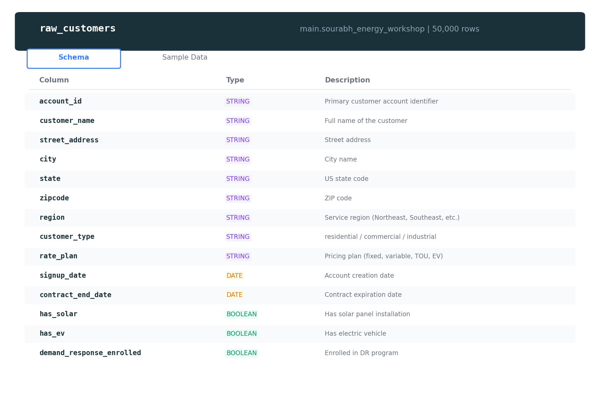

# Module 4B: Debugging & Observability (60 min)

**Storyline:** *"Production is on fire. A pipeline is failing, dashboards show stale data, and a SQL query is running 10x slower than usual."*

---

## Prerequisites

- Access to Databricks workspace with Genie Code enabled
- Workshop folder with `04b_broken_notebook` (or equivalent broken notebook)
- Access to a Lakeflow pipeline from Module 2 (or ability to create one)
- Tables in `main.sourabh_energy_workshop`


*The `raw_customers` table schema — understanding column names is key to debugging join and filter errors.*

---

## Section A: Notebook Debugging (15 min)

### Step 1: Open the Broken Notebook

1. Navigate to the workshop folder in your Databricks workspace
2. Open **04b_broken_notebook** (or the provided broken notebook)

---

### Scenario 1: Column Rename Cascade Failure

**Setup:** Cell 3 renames `account_id` to `cust_id`. Cell 5 references `account_id`.

1. Run cells **1 through 5** in order
2. Observe that **Cell 5 fails** with an error (e.g., column not found)

**Diagnose:**

1. Click **Diagnose Error** on the failed cell (if available)
2. In the Genie Code pane, ask:

```
Why is cell 5 failing? Trace the issue back to its source.
```

**Expected result:** Genie Code traces the error to Cell 3’s rename and suggests using `cust_id` in Cell 5.

**Fix:** Update Cell 5 to use `cust_id` instead of `account_id`, or revert Cell 3’s rename.

---

### Scenario 2: Slow Full Table Scan

**Setup:** Cell 6 runs an aggregation over `raw_meter_readings` (10.7M rows) without filters.

1. Run **Cell 6**
2. Note that it runs slowly (full table scan)

**Optimize:**

1. Click the **Optimize** button (if available) on the cell output, or
2. Type `/optimize` in the Genie Code pane, or
3. Ask:

```
This aggregation is very slow. How can I optimize it?
```

**Expected result:** Genie Code suggests partition filters, date range limits, pre-aggregation, or sampling.

**Key concept:** Always filter large tables (e.g., by date, state) before aggregating.

---

### Scenario 3: Missing Package (Prophet)

**Setup:** Cell 8 imports `prophet` (or another optional package).

1. Run **Cell 8**
2. Observe `ModuleNotFoundError` or similar

**Fix:**

1. Use `/repairEnvironment` or `/fix` in Genie Code, or
2. Ask: **"Fix the missing prophet import"**

**Expected result:** Genie Code suggests installing the package (e.g., `%pip install prophet`) or using an alternative.

---

### Scenario 4: Wrong Churn Threshold

**Setup:** Cell 10 uses an incorrect column or threshold for churn flagging, so almost every customer is flagged.

1. Run **Cell 10**
2. Inspect the output – most customers are marked as churn

**Diagnose:**

```
The churn flagging is wrong - almost every customer is flagged. What's the issue?
```

**Expected result:** Genie Code identifies the wrong column (e.g., `balance` instead of `is_delinquent`) or an inverted/threshold logic error.

**Fix:** Correct the column reference or threshold in Cell 10.

---

## Section B: SQL Editor Debugging (10 min)

### Step 1: Open SQL Editor with Genie Code

1. Open **SQL Editor** in Databricks
2. Open the **Genie Code** pane (Agent mode)

---

### Step 2: Paste Broken SQL

Paste SQL that has:

- Wrong table alias (e.g., `c` used but `cust` defined)
- Missing `GROUP BY` for aggregated columns

Example:

```sql
SELECT c.state, SUM(b.amount_charged) as revenue
FROM main.sourabh_energy_workshop.raw_customers cust
JOIN main.sourabh_energy_workshop.raw_billing b ON cust.account_id = b.customer_id
GROUP BY c.state;
```

**Ask Genie Code:**

```
Fix this SQL - it has errors.
```

**Expected result:** Genie Code corrects `c` to `cust` and ensures the `GROUP BY` matches the SELECT.

---

### Step 3: Slow Query Without Partition Filter

1. Run a query on `raw_meter_readings` (10.7M rows) without a date filter
2. Observe slow execution

**Ask Genie Code:**

```
This query is slow. Optimize it.
```

**Expected result:** Genie Code suggests adding a `WHERE` on `timestamp` or another partition column.

---

### Step 4: Query Profiles

1. After running a query, open the **Query Profile** (or execution details)
2. Review: stages, shuffle, spill, skew
3. Use Genie Code to interpret: **"Explain what's causing the slow stage in this query profile"**

---

## Section C: Lakeflow Pipeline Debugging (20 min)

### Step 1: Open the Pipeline

1. Navigate to **Workflows** → **Pipelines** (or Lakeflow Pipelines)
2. Open the pipeline from **Module 2** (or create a simple pipeline that reads from `main.sourabh_energy_workshop`)

---

### Step 2: Introduce a Failure

Deliberately break the pipeline, for example:

- Change a table name to one that doesn’t exist
- Introduce a schema mismatch (wrong column type)
- Add a data quality expectation that fails on current data

---

### Step 3: Ask Genie Code to Fix

1. Open the pipeline definition (YAML or UI)
2. In Genie Code (or a notebook with pipeline code), ask:

```
Fix the failure in this pipeline
```

**Expected result:** Genie Code identifies the error and suggests corrections (table name, schema, DQ rules).

---

### Step 4: Explore Event Logs and Run Status

1. Open **Event Log** for the pipeline run
2. Check **Pipeline run status** (Running, Failed, Completed)
3. Review **Data Quality expectations** and failures

---

### Step 5: Query System Tables

Run this in SQL Editor (adjust filters as needed):

```sql
SELECT *
FROM system.lakeflow.job_run_timeline
WHERE pipeline_name = 'your_pipeline_name'
ORDER BY start_time DESC
LIMIT 20;
```

**Discuss:** Jobs Matrix view, Gantt view, and how to correlate failures with specific tasks.

---

## Section D: Proactive Monitoring Discussion (5 min)

### Genie Code Proactive Capabilities

- **Error diagnosis:** Explains failures and suggests fixes
- **Optimization suggestions:** Identifies slow queries and recommends improvements
- **Environment repair:** Suggests package installs and config changes

### Pipeline Notifications

1. In the pipeline settings, configure **notifications** (email, Slack, webhook)
2. Set alerts for: Failed runs, long-running runs, DQ failures

### Event Hooks

- **On success:** Trigger downstream jobs or send success notifications
- **On failure:** Alert, retry, or rollback
- **On DQ failure:** Notify data owners, pause pipeline

---

## Hands-On Challenge

**Introduce a DQ failure, diagnose with Genie Code, configure alerts, and query system tables.**

1. Add a data quality expectation to a pipeline (e.g., `expect_column_values_to_not_be_null` on a nullable column, or a strict range check)
2. Run the pipeline and let it fail on DQ
3. Use Genie Code: **"Why did this pipeline fail? What DQ expectation failed?"**
4. Configure an alert for pipeline failure (email or Slack)
5. Query `system.lakeflow.job_run_timeline` (or equivalent) to see the failed run

**Time:** ~15 minutes

---

## Troubleshooting

| Issue | Possible fix |
|-------|--------------|
| "Diagnose Error" not visible | Use Genie Code chat to describe the error and ask for diagnosis |
| Optimize suggests changes that break logic | Review suggestions; apply only safe optimizations |
| Prophet/package install fails | Check cluster Python version; use `%pip install` in a notebook cell |
| System table query returns no rows | Verify pipeline name, workspace, and permissions |
| Pipeline YAML not found | Ensure pipeline is saved; check path in workspace |

---

## Key Takeaways

- **Notebook debugging:** Use Diagnose Error, Genie Code, and /optimize for failures and performance
- **SQL debugging:** Fix syntax/alias errors and add partition filters for large tables
- **Pipeline debugging:** Use event logs, run status, DQ expectations, and system tables
- **Proactive monitoring:** Notifications and event hooks reduce manual firefighting
- **System tables:** `system.lakeflow.job_run_timeline` and related tables support operational visibility
